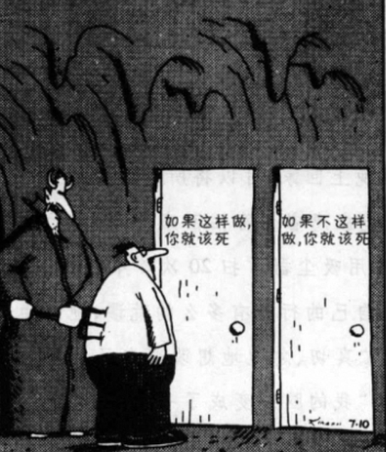

export const metadata = {
  title: "脑锁：如何摆脱强迫症",
};

# 脑锁：如何摆脱强迫症

你有没有停不下来的念头，或明知没必要、却非做不可的行为？

强迫症会把人拖进一套自我削弱的循环：为了躲开想象中的灾难，你去检查、清洗、计数、确认；这些行为和威胁之间并没有真实的因果，但每一次屈服，都会再削掉一点对生活的掌控。掌控感越少，下一次冲动就越难扛；冲动越强，人就越觉得「只能再做一次」。

## 两扇门，和背后的长矛

冲动升起时，往往只有两个选项，且都不讨好。

做了仪式，焦虑会暂时退下去，但你会更恨自己的软弱，也知道心瘾被喂大了一轮。硬扛不做，焦虑会像潮水一样漫上来，胸口发紧，脑子里只有一个声音在敲：「还不去处理，就来不及了。」

<figure className="my-8">
  
  <figcaption className="mt-2 text-xs text-center text-muted-foreground">
    左门：做了，症状加深。右门：不做，焦虑噬人。强迫症最擅长的，就是把人卡在这里。
  </figcaption>
</figure>

Jeffrey Schwartz 在 UCLA 训练患者时指出：还有**第三道门**。它不会自己出现，需要主动去找——门后是**四步骤法**（Four-Step Method）。目的不是和焦虑硬碰硬，而是换一套应对方式，让大脑慢慢从错误的回路里抽身。

## 医生真正在问什么

初次就诊，很多人会说：「医生，我老觉得手脏。」有经验的医生会知道，脏不脏不是重点。重点是：洗了很多次，检查了很多遍，**那股要再洗、再查的冲动仍然不消退**。

这才是强迫症的形式：无意义的念头和冲动，以很高的频率闯进意识，而且不会自己减弱。

问题出在大脑神经递质的**生化失衡**——眶额皮层、尾状核等环路代谢过高，不是「想太多」或「意志力不够」。

<figure className="my-8">
  
  <figcaption className="mt-2 text-xs text-center text-muted-foreground">
    右侧患者扫描中，眶额皮层亮成一片。这是可以观察、可以训练改变的生物学问题。
  </figcaption>
</figure>

先把身份分开：**这不是我的本质，而是强迫症的症状。** 剩下的事才有抓手。

## 不能等念头自己走

若抱着「冲动不走，我什么都不能做」，生活会被仪式整个吞掉。

换个场景：你在读书，楼下汽车报警器一直响。你不会说「报警器不停，我连书都不翻」——你会尽量绕开噪音，把眼睛留在段落上，读进去之后，报警声还在，但已经没那么占满注意力。

强迫症可以同样处理：**把注意转向一件具体的、值得做的事**，骚扰性的念头还在，但不必让它掌舵。

这是医学意义上的疾病，想稳定改善，大脑（至少神经化学）要发生变化。行为训练做得到；药物在部分个案里是辅助，像学游泳时的浮板。UCLA 的常见做法是：**四步骤练得越熟，药物往往越可以减。**

## 四步骤：一层层卸力

四步不是并列的口诀，而是一次冲动从升起到退场的完整路径。前一步没站稳，后一步很难生效。

### 一、重新确认（Relabel）

冲动刚冒头，先命名它。

脑子里可能是：「我得再去洗一次手，虽然知道没必要。」  
你要改口成：「**我在经历强迫症症状**，这是疾病在说话，不是事实。」

命名完，才会问对问题：为什么同样的冲动一再回来？因为病还在，不是因为你是怎样的人。

### 二、重新归因（Reattribute）

命名之后，接着**归因于疾病**：

这些念头来自强迫症；是大脑生化失衡送出的错误信号，不是人格缺陷，也不是真实危险。

归因完，问题从「我怎么办才安全」变成「**现在我能做什么更有用的事**」。注意力第一次有机会从恐惧里挪开。

### 三、重新聚焦（Refocus）

把症状当成**错误的神经信号**，下一步是换挡。

冲动起来后的头几分钟最关键：不要和它辩论，也不要立刻去履行仪式。选一件具体的事去做——出门走五分钟、回一封邮件、收拾桌面，任何有起止、有产出的行动都行。用新行为占住手和时间，让旧的回路这次没跑完。

这一步最难，也是**神经可塑性**动得最多的一步。多练几次，大脑才会真的开始走新路。

### 四、重新评价（Revalue）

几次之后，你会更快看穿念头的内容：它没有信息，不值得尊敬。

熟练时，反应接近一句内心旁白：「又是强迫信号，无意义。我回到该做的事。」  
到这一步，冲动可能还在，但已经不再发号施令。

## 下一次冲动来时

不妨按时间顺序走一遍：

念头升起 → **重新确认**（这是症状）→ **重新归因**（病在发信号，不是我的错）→ **重新聚焦**（去做那件具体的事）→ 事后 **重新评价**（它依然不值得信）。

生活上，你会重新感到「我可以选择」；大脑层面，研究也看到强迫相关环路的代谢可以往正常方向回调。念头还会来，但来得更稀、更短，也更容易被识破、被绕开。

---

整理自 Jeffrey M. Schwartz, *Brain Lock*（中译《脑锁》）及 UCLA 强迫症研究项目中的行为训练方案。
